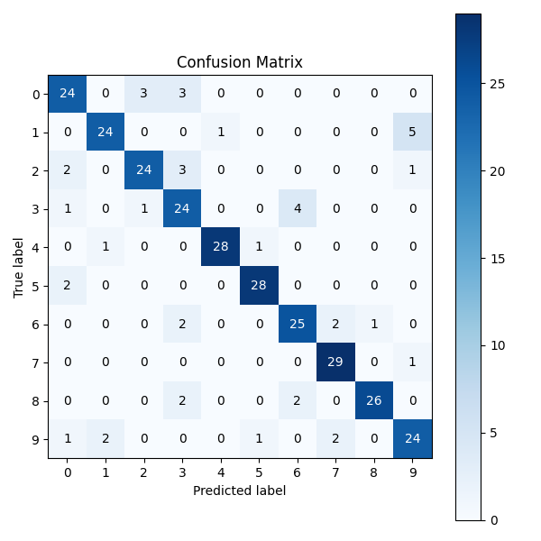
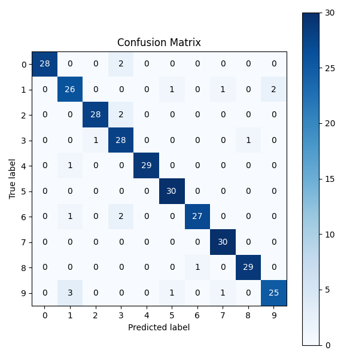

# Spoken Digit Recognition (FSDD)

This repository provides a modular Python system for classifying spoken digits (0–9) using the Free Spoken Digit Dataset (FSDD). It supports multiple algorithms and interactive real-time prediction. Free for academic/research use under [CC BY 4.0](https://creativecommons.org/licenses/by/4.0/).

## Features
- Fast, lightweight audio digit classifier
- Modular code: data loading, feature extraction, modeling, evaluation
- Supports Logistic Regression and Random Forest
- Interactive real-time demo: choose model, record, and predict

## Dataset
- [Free Spoken Digit Dataset (FSDD)](https://huggingface.co/datasets/mteb/free-spoken-digit-dataset)
- Format: Parquet, 8kHz, digits 0–9, multiple speakers
- Download: `git clone https://huggingface.co/datasets/mteb/free-spoken-digit-dataset`


## Requirements
- Python 3.9+
- See `requirements.txt` for all required Python packages.

## Installation
```bash
pip install -r requirements.txt
```

## Usage
### Train & Evaluate
1. Download FSDD and set paths in `main.py`.
2. Run:
	```bash
	python src/main.py
	```
3. View accuracy, confusion matrices, and classification reports for both models.

### Real-Time Demo
1. Train models as above.
2. Run:
	```bash
	python src/realtime.py
	```
3. Choose model (Logistic Regression or Random Forest), press SPACE to record, and speak a digit.

## Code Structure
- `src/data.py` – Load and preprocess dataset
- `src/features.py` – Feature extraction
- `src/model.py` – Model definition and training
- `src/evaluate.py` – Evaluation metrics and visualization
- `src/realtime.py` – Interactive real-time demo
- `src/main.py` – Training/evaluation entrypoint

## Results
### Logistic Regression
- **Test Accuracy:** ~0.85
- 
```
			  precision    recall  f1-score   support
		   0       0.80      0.80      0.80        30
		   1       0.89      0.80      0.84        30
		   2       0.86      0.80      0.83        30
		   3       0.71      0.80      0.75        30
		   4       0.97      0.93      0.95        30
		   5       0.93      0.93      0.93        30
		   6       0.81      0.83      0.82        30
		   7       0.88      0.97      0.92        30
		   8       0.96      0.87      0.91        30
		   9       0.77      0.80      0.79        30
	accuracy                           0.85       300
   macro avg       0.86      0.85      0.85       300
weighted avg       0.86      0.85      0.85       300
```

### Random Forest
- **Test Accuracy:** ~0.93
- 
```
			  precision    recall  f1-score   support
		   0       1.00      0.93      0.97        30
		   1       0.84      0.87      0.85        30
		   2       0.97      0.93      0.95        30
		   3       0.82      0.93      0.88        30
		   4       1.00      0.97      0.98        30
		   5       0.94      1.00      0.97        30
		   6       0.96      0.90      0.93        30
		   7       0.94      1.00      0.97        30
		   8       0.97      0.97      0.97        30
		   9       0.93      0.83      0.88        30
	accuracy                           0.93       300
   macro avg       0.94      0.93      0.93       300
weighted avg       0.94      0.93      0.93       300
```

---
**License:**
This work is licensed under a [Creative Commons Attribution 4.0 International License (CC BY 4.0)](https://creativecommons.org/licenses/by/4.0/).
