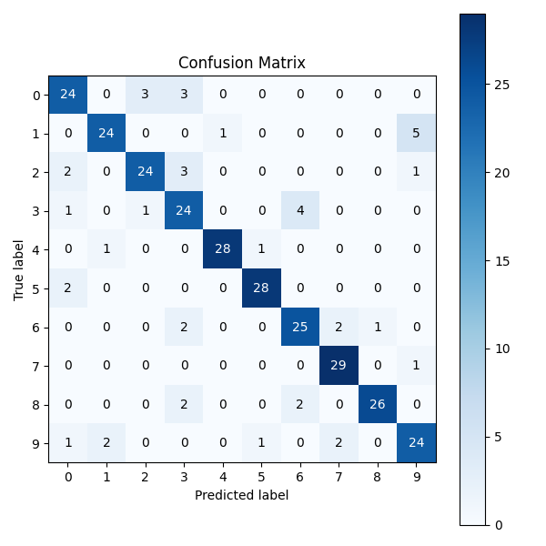

# Spoken Digit Recognition (FSDD)

This repository provides a lightweight, modular Python system for classifying spoken digits (0–9) using the Free Spoken Digit Dataset (FSDD). It is designed for fast inference and easy experimentation, and is free to use for academic and research purposes under the [Creative Commons Attribution 4.0 International (CC BY 4.0)](https://creativecommons.org/licenses/by/4.0/).

## Features
- Fast, lightweight audio digit classifier
- Modular code: data loading, feature extraction, modeling, evaluation
- Accuracy, confusion matrix, and classification report
- Real-time microphone demo (press SPACE to start/stop recording)

## Dataset
- [Free Spoken Digit Dataset (FSDD)](https://huggingface.co/datasets/mteb/free-spoken-digit-dataset)
- Format: Parquet, 8kHz, digits 0–9, multiple speakers
- Download: `git clone https://huggingface.co/datasets/mteb/free-spoken-digit-dataset`

## Requirements
- Python 3.9+
- numpy, pandas, scikit-learn, librosa, matplotlib, sounddevice, joblib, pyarrow, soundfile, keyboard

## Installation
```bash
pip install numpy pandas scikit-learn librosa matplotlib sounddevice joblib pyarrow soundfile keyboard
```

## Usage
### Train & Evaluate
1. Download FSDD and set paths in `main.py`.
2. Run:
	```bash
	python src/main.py
	```
3. View accuracy and confusion matrix.

### Real-Time Demo
1. Train model as above.
2. Run:
	```bash
	python src/realtime.py
	```
3. Press SPACE to start/stop recording, then speak a digit.

## Code Structure
- `src/data.py` – Load and preprocess dataset
- `src/features.py` – Feature extraction
- `src/model.py` – Model definition and training
- `src/evaluate.py` – Evaluation metrics and visualization
- `src/realtime.py` – Real-time microphone demo
- `src/main.py` – Entrypoint for training/evaluation

## Results
- **Test Accuracy:** ~0.85
- **Confusion Matrix:**




**Classification Report:**
```
				  precision    recall  f1-score   support

			  0       0.80      0.80      0.80        30
			  1       0.89      0.80      0.84        30
			  2       0.86      0.80      0.83        30
			  3       0.71      0.80      0.75        30
			  4       0.97      0.93      0.95        30
			  5       0.93      0.93      0.93        30
			  6       0.81      0.83      0.82        30
			  7       0.88      0.97      0.92        30
			  8       0.96      0.87      0.91        30
			  9       0.77      0.80      0.79        30

	 accuracy                           0.85       300
	macro avg       0.86      0.85      0.85       300
 weighted avg       0.86      0.85      0.85       300
```

---
**License:**
This work is licensed under a [Creative Commons Attribution 4.0 International License (CC BY 4.0)](https://creativecommons.org/licenses/by/4.0/).
